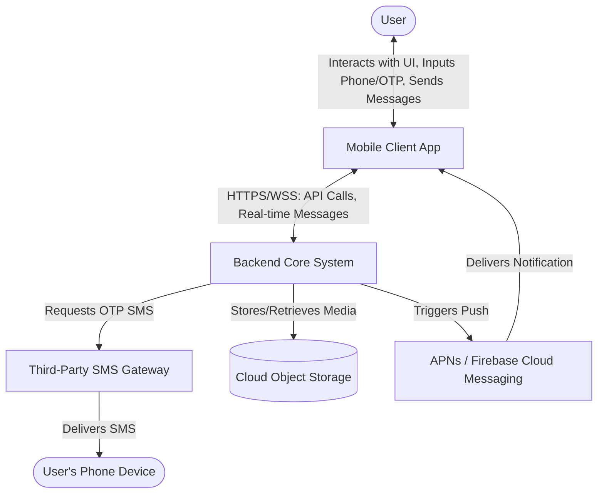

# Software Requirements Specification (SRS)
**Project Name**: Universal Chat Application
**Date**: 2026-06-19

---

## 1. System Overview and Problem Statement

### System Overview
The system is a modern, real-time mobile chat application built with React Native and the Expo framework. It is designed to facilitate seamless, secure, and instant communication between users. The application provides a unified platform featuring one-on-one chats, group chats, and contact management, coupled with a frictionless onboarding experience.

### Problem Statement
In today's fast-paced environment, users need a reliable and intuitive way to communicate via text, voice, and media without dealing with complex signup processes. Many existing solutions are either bloated or require cumbersome email/password registrations. This system aims to solve the problem of fragmented and high-friction communication by providing a streamlined, fast, and visually appealing messaging platform that leverages simple phone number and OTP-based authentication.

---

## 2. Stakeholder Analysis

1. **End Users**: Individuals using the app to communicate with friends, family, or colleagues. They expect a fast, intuitive, secure, and visually pleasing messaging experience.
2. **Administrators/Moderators**: Personnel responsible for managing the platform, handling user reports, and ensuring compliance and safety guidelines.
3. **Development Team**: Frontend and backend engineers, designers, and QA testers responsible for building, updating, and maintaining the application.
4. **Business Owners/Sponsors**: Stakeholders investing in the application, looking for user growth, engagement, platform stability, and potential monetization avenues.
5. **Third-Party Providers**: External services such as SMS gateways (for OTP delivery), Push Notification services (APNs/FCM), and cloud storage providers (for media hosting).

---

## 3. Functional Requirements

1. **Phone Number Registration**: The system shall allow users to register an account by entering their valid mobile phone number.
2. **OTP Verification**: The backend shall generate and send a 6-digit One-Time Password (OTP) via SMS to the user's phone number to verify identity and authorize login.
3. **Profile Management**: Users shall be able to create and update their profiles, including setting a display name, bio, and profile avatar.
4. **Contact Synchronization**: The system shall allow users to sync their device's address book to identify and connect with other existing users on the platform.
5. **One-on-One Messaging**: Users shall be able to send and receive real-time text messages to and from individual contacts.
6. **Group Chats**: Users shall be able to create group chats, define a group name, and add multiple contacts to the conversation.
7. **Media & Attachments**: The system shall support sending and receiving rich media, including voice notes, images, and stickers within any chat.
8. **Message Status Indicators**: The system shall display message delivery and read receipts (e.g., sent, delivered, read) to the sender in real-time.
9. **Chat Organization**: Users shall be able to pin important chats to the top of their list, mute notifications for specific chats, and use a search function to find specific conversations or contacts.
10. **Presence & Activity**: The system shall display real-time "Online" status and "Typing..." indicators when a user is active or currently composing a message.

---

## 4. Non-Functional Requirements

1. **Performance/Latency**: The system shall deliver text messages end-to-end within **500 milliseconds** under standard 4G/5G/Wi-Fi network conditions.
2. **Scalability**: The backend architecture shall be capable of supporting up to **10,000 concurrent connections** without degrading message delivery times beyond 1 second.
3. **Availability**: The core messaging service shall maintain a **99.9% uptime** per month, equating to no more than 43.8 minutes of unexpected downtime.
4. **Security**: All communication between the mobile client and the backend servers shall be encrypted in transit using **TLS 1.3** or higher. User sessions must be securely tokenized following successful OTP verification.
5. **Usability**: The application shall load the main chat list screen in under **2.0 seconds** on standard mid-range mobile devices (e.g., iPhone 11 or equivalent Android devices).

---

## 5. Context Diagram and System Boundary

### System Boundary
The Chat Application System boundary encompasses the mobile client application (React Native/Expo app) and the proprietary backend servers (handling user data, session management, messaging routing, and state).

### Context Description

- **User**: Inputs their phone number, receives the OTP, and sends/receives messages.
- **Mobile Client**: The React Native application residing on the user's device.
- **Backend Core System**: The central server processing business logic, routing messages, and storing data.
- **Third-Party SMS Gateway**: External service (e.g., Twilio, AWS SNS) used to dispatch SMS OTPs.
- **Cloud Object Storage**: External service (e.g., AWS S3) for storing user avatars and media attachments.
- **Push Notification Service**: Apple Push Notification service (APNs) and Firebase Cloud Messaging (FCM) used to wake the app and notify offline users of new messages.

---

## 6. Constraints, Assumptions, and Glossary

### Constraints
- The frontend must be developed using React Native and Expo (SDK 56).
- The application must natively support both iOS and Android platforms from a single codebase.
- Authentication is strictly limited to phone numbers and OTPs; alternative login methods (e.g., email/password, social OAuth) are out of scope.

### Assumptions
- Users have an active cellular plan capable of receiving SMS messages.
- Users have a stable internet connection (Wi-Fi or cellular data) required to send and receive messages.
- The integrated external SMS gateway will reliably deliver OTPs within an acceptable timeframe (typically under 10 seconds).
- Users will grant necessary device permissions (Contacts, Notifications, Microphone) for full feature functionality.

### Glossary
- **OTP**: One-Time Password; a securely generated numeric code valid for a single login session.
- **APNs**: Apple Push Notification service.
- **FCM**: Firebase Cloud Messaging.
- **Expo**: A framework and a platform for universal React applications.
- **WSS**: WebSocket Secure; a protocol providing full-duplex communication channels over a single TCP connection, used for real-time messaging.
- **TLS**: Transport Layer Security; a cryptographic protocol designed to provide communications security over a computer network.
